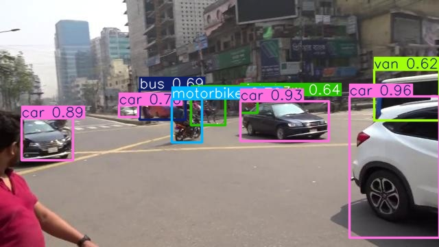
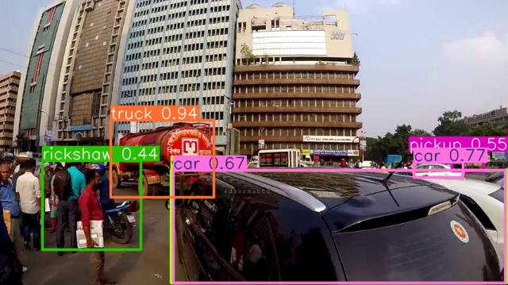
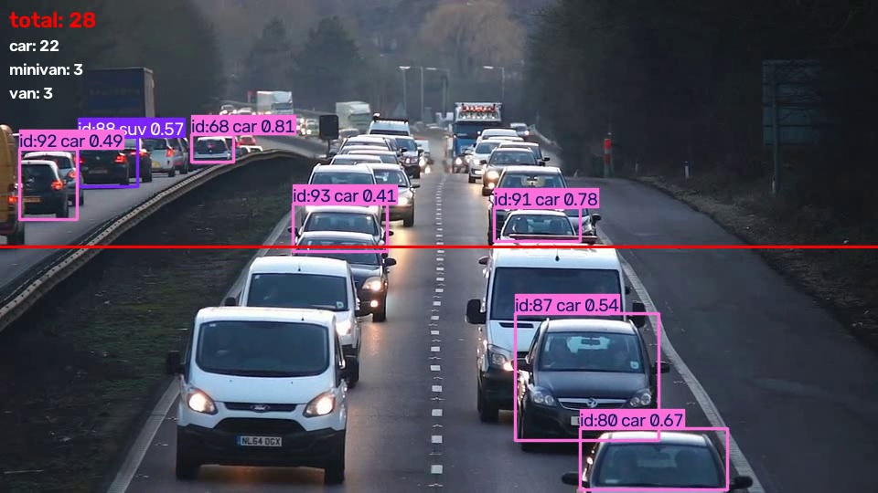

# 交通監視・カウントデモ (Traffic Counting Demo)

YOLO(Ultralytics YOLO11)による交通監視カメラ映像からの車両検出・種別分類・
通過台数カウントのデモ。COCO事前学習済みモデルを車両データセットでファインチューニングし、
動画に対するリアルタイム追跡・ライン通過カウントまで実装しています。

「[衛星画像物体検出デモ](https://github.com/ndw-kkoki/satellite-object-detection-demo)」(Faster R-CNN)の
対になる作品として、リアルタイム性が求められる用途でのYOLO(一段階検出)の速度優位性を示すために制作しました。

---

## 概要・データセット

[Road Vehicle Images Dataset](https://www.kaggle.com/datasets/ashfakyeafi/road-vehicle-images-dataset)
(Kaggle公開、DbCL-1.0ライセンス)を使用。交通監視カメラ視点の車両画像3,004枚
(train 2,704 / valid 300)に、21クラスの車両種別がYOLO形式でアノテーションされています。

- クラス: car, bus, truck, motorbike, bicycle, rickshaw, auto rickshaw,
  three wheelers(CNG), van, minivan, minibus, pickup, suv, taxi, scooter,
  ambulance, policecar, army vehicle, garbagevan, human hauler, wheelbarrow
- 車種の粒度が細かく(21クラス)、単純な「car」検出よりも実務に近い難易度
- train/valid分割済み(データセット提供元による)

デモ動画は [Pexels](https://www.pexels.com/video/traffic-flow-in-the-highway-2103099/)
(Mike Bird撮影、Pexels License: 商用利用可・クレジット表記不要)の
フリー素材を使用しています。

## アーキテクチャ

```
学習: download_dataset.py(Kaggle CLI) → data/data.yaml
                                              │
                       train.py(Ultralytics) ── models/best.pt
                              │
評価: evaluate.py(Ultralytics validate でmAP算出)
推論: infer.py(単一画像) ── demo.py(検出結果を画像として保存)
                          └── api.py(FastAPI /detect エンドポイント)
追跡・カウント: count_video.py
    YOLO + ByteTrack(Ultralytics標準搭載)でトラックIDを付与
        │
    counter.py(LineCounter): トラックの重心がラインを跨いだ瞬間を検出し、
    トラックIDごとに一度だけクラス別カウント(純粋関数として実装、動画I/Oに非依存)
```

**なぜYOLOか**: 交通監視は「毎フレーム・毎車線をリアルタイムに処理し続ける」ことが
要件になるため、Region Proposalを経ない一段階検出のYOLOは、
[Faster R-CNN](https://github.com/ndw-kkoki/satellite-object-detection-demo)
より高いfpsを実現できます。精度と速度どちらを優先すべきかの実測比較は
[検出モデル比較Webアプリ](https://github.com/ndw-kkoki/detection-model-comparator)
で扱う予定です。

## セットアップ

```bash
pip install -r requirements.txt
python scripts/download_dataset.py        # data/train, data/valid, data/data.yaml(約115MB)
python scripts/download_sample_video.py   # data/sample_traffic.mp4(カウントデモ用、約11MB)
```

`download_dataset.py` は Kaggle CLI の認証(`~/.kaggle/access_token` 等)が必要です。
Windows PowerShellの場合、以降の `PYTHONPATH=src <command>` は
`$env:PYTHONPATH = "src"; <command>` と読み替えてください。

### 学習

```bash
PYTHONPATH=src python -m trafficdet.train --epochs 80 --batch 32 --imgsz 640 --patience 15
```

GPU(CUDA)があれば自動的に使用します。`models/best.pt` に最良モデルを保存します。

### 評価(mAP)

```bash
PYTHONPATH=src python -m trafficdet.evaluate
```

### 動作確認(検出結果を画像で保存)

```bash
PYTHONPATH=src python -m trafficdet.demo
```

### 通過台数カウント(動画)

```bash
PYTHONPATH=src python -m trafficdet.count_video --source data/sample_traffic.mp4
```

`models/counted_output.mp4`(注釈付き動画)と `models/counted_output.json`
(クラス別カウント結果)を出力します。ライン位置は `--line x1,y1,x2,y2` で指定できます
(省略時は画面中央の水平線)。

### 推論APIを起動する

```bash
PYTHONPATH=src uvicorn trafficdet.api:app --reload
```

```bash
curl -X POST "http://127.0.0.1:8000/detect?conf=0.4" \
  -F "file=@data/valid/images/<任意の画像>.jpg"
```

## 評価結果

valid分割(300枚)での評価。Kaggle Notebooks(Tesla P100)でYOLO11nを80epoch分学習
(patience=15で早期終了設定)。

| 指標 | 値 |
|---|---|
| mAP@[.50:.95] | **0.266** |
| mAP@.50 | **0.425** |
| 推論速度 | **約4.3ms/枚**(前処理・後処理込みで約7.2ms ≒ 139fps) |

車種によって出現数に偏りがあるデータセットのため(例: policecar・scooterは1枚のみ)、
主要クラス(car/bus/motorbike/rickshaw/three-wheelers-CNG/truck)はmAP50が0.55〜0.73と
実用的な精度が出ている一方、レアクラスは0に近い。推論速度は
[Faster R-CNN版](https://github.com/ndw-kkoki/satellite-object-detection-demo)
(二段階検出)よりも大幅に高速で、一段階検出のリアルタイム性優位性を裏付けている。

検出例(信頼度閾値0.4):



交差点で car・bus・motorbike・van を同時に正しく検出できている例。



truck・rickshaw・pickup・car など、車種の異なる車両を細かく分類できている例。

### 通過台数カウントの実行結果

Pexels提供のフリー素材動画(学習データとは別の、一般的な高速道路の映像)に対して
`count_video.py` を実行した結果:

```json
{
  "total": 35,
  "counts": { "car": 29, "van": 3, "minivan": 3 }
}
```

学習データはバングラデシュの市街地車両が中心のため、高速道路映像ではrickshaw等の
現地特有車種は登場せず、car/van/minivanといった共通クラスのみが検出されている
(ドメインが異なる映像でも主要クラスの検出・追跡・カウントが機能することを確認)。



トラッキングID・クラス・信頼度・通過ライン(赤線)・累計カウント(左上)を
同時に可視化している。

## テスト

```bash
pytest
```

ライン通過判定ロジック(`counter.py`)はモデル・GPU・動画に依存しない純粋関数として
実装しているため、データセットやGPUがない環境でもユニットテストが実行できます。
